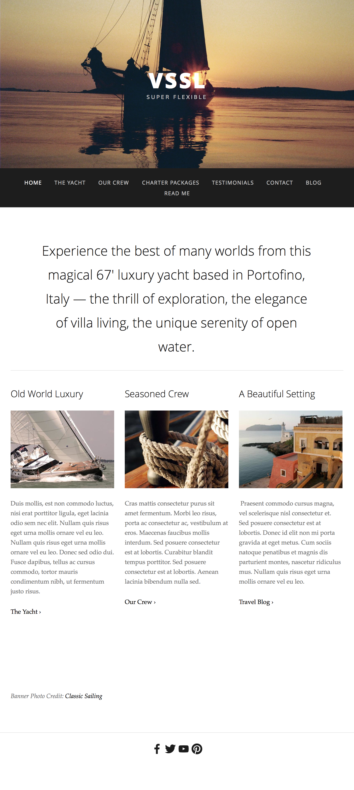

# WDIR-Gizmo

---

Title: Mockup - VSSL 
Type: Morning Exercise  
Duration: "0:45" 
Creator: 
    Original creators: WDI-Archer, WDI-Funke, WDI-Panthalassa 
    Adapted by: Kristyn Bryan 
Competencies: Basic HTML & CSS blocks 
Prerequisites: CSS, HTML  

---

## Setup

1. Inside your `student_examples` folder for today, create a folder called `vssl_mockup`
2. Navigate inside `vssl_mockup` and create an `index.html` file and a `style.css` file.
3. From inside your `vssl_mockup` folder, create another **folder** called `img`.
4. Navigate inside `img` and **copy** the images that are provided for you inside this `morning_exercise` folder in the `vssl` directory in the `img` directory (reminder to use the `-r` flag when copying the contents of a folder).
5. Connect your CSS file to your HTML file and make sure that it is attached (hint: give the body a background color temporarily)

## Resources

1. Your main focus is on positioning the content. See the links below for guides on using Flexbox.
2. Images - You have been provided with all of the images that you need to create this mockup. Take a look at what you have before you begin.
3. Text - Feel free to use `lorem` in place of this real text. As for the font, save this for *last* step. You don't need the exact font - just choose something that looks similar.

## Flexbox:
[A Complete Guide to Flexbox (CSS Tricks](https://css-tricks.com/snippets/css/a-guide-to-flexbox/)  
[Equidistance Spacing- examples of failed attempts and wins](https://css-tricks.com/equidistant-objects-with-css/)
