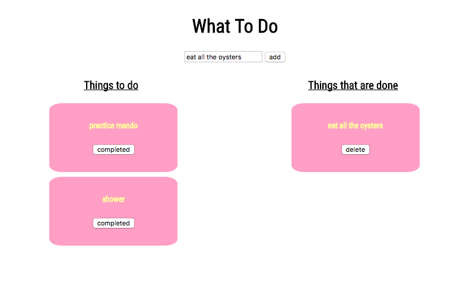

# WDIR-GIZMO

---
Title: Todo <br>
Type: lesson<br>
Creator: Jim Haff for WDI-GiZMO<br>
Competencies: jQuery, Javascript, DOM <br>

---


### We are going to create the following




### Setup 

* open the todo folder in student examples
* read over the code
* make sure the javascript and css is hooked up
* add window onload to js file

```
$(() => {
  // write code here
  console.log('window is loaded')
})
```

### User Stories
Your user should be able to:

* Enter a 'todo' item in the input box, and click the 'add' button to have the todo item render in the to-do-list column.

* Click on a button within the to-do-item to move that item over to a 'completed' column.

* Click that same button to remove the todo item from the page.

#### First Step add an event Listener to the `add` button

```
  $('button').on('click', () => {
    console.log('click is working')

  })

```

1.  Now we need to grab the `value` of the input that we type into, we can do this by doing the following

```

  $('button').on('click', () => {
    
    const $inputVal = $('input').val();
    
    // check to make sure you are getting the correct value, should be whatever you type into the input
    console.log($inputVal)

  })

```

2.  Lets create A function that creates a todo for us

~ this function will create a `div` with an `h5` as the todo text and a `completed` button

- first lets create the things we need

```
const createTodo = (todoText) => {
  // add the class 'todos' so the css is applied
  const $div = $('<div/>').addClass('todos');
  // create an h5 to hold whatever our todo is 
  const $h5 = $('<h5/>');
  // create button to click when the todo is completed
  const $completedBtn = $('<button/>');
}
```

```
  // this will create a div element to add to the dom
 $('<div/>')
 // this will also create a div element to add to the dom
 $('<div></div>')

```

~ Now Try and add the text to the `h5`. How can you confirm?

```
const createTodo = (todoText) => {
  // add the class 'todos' so the css is applied
  const $div = $('<div/>').addClass('todos');
  // create an h5 to hold whatever our todo is 
  const $h5 = $('<h5/>');
  // create button to click when the todo is completed
  const $completedBtn = $('<button/>');

   // add text to the todo h5
  $h5.text(todoText);
}
```

~ Now lets add everything to the dom

```
const createTodo = (todoText) => {
  // add the class 'todos' so the css is applied
  const $div = $('<div/>').addClass('todos');
  // create an h5 to hold whatever our todo is 
  const $h5 = $('<h5/>');
  // create button to click when the todo is completed
  const $completedBtn = $('<button/>');

   // add text to the todo h5
  $h5.text(todoText);

   // add the h5 to the div
  $div.append($h5);

  // add the text to the button to the div
  $completedBtn.text(btnText);
  // add the completedDiv to the div
  $div.append($completedBtn);
  

  // append div to col-1
  $('#col-1').append($div);

}
```

~ Now how do we use that function?

Back to the beginning:

```
  $('button').on('click', () => {
    const $inputVal = $('input').val();

    createTodo($inputVal);

  })

```


### Now lets add the event listener to the completed button in order to move the button to the 'Things that are done' column.


~ Lets go back inside our createTodo function
~ add an event listener to completedBtn and `console.log` to make sure it works

```
const createTodo = (todoText) => {

  const $div = $('<div/>').addClass('todos');
  const $h5 = $('<h5/>');
  const $completedBtn = $('<button/>');

  $h5.text(todoText);

  $div.append($h5);
  $completedBtn.text(btnText);

  // lets add the event listener here
  
  $completedBtn.on('click', (e) => {
    console.log('this is working')
  })


  $div.append($completedBtn);
  
  $('#col-1').append($div);

}
```

Remember `e.currentTarget` will give you the current object you are clicking on

~ inside of eventListner try to implement the following
1.  Now try to grab the `div` of the current todo and detach it.  Maybe the jquery method `detach()` may help :)

2.  Change the text of the button to `delete`
3.  Append the div to the "Things that are done" column


```
const createTodo = (todoText) => {

  const $div = $('<div/>').addClass('todos');
  const $h5 = $('<h5/>');
  const $completedBtn = $('<button/>');

  $h5.text(todoText);

  $div.append($h5);
  $completedBtn.text(btnText);

  // lets add the event listener here
  
  $completedBtn.on('click', (e) => {
    console.log('this is working')
  
    // grab and detach the current div
    const $currentDiv = $(e.currentTarget).parent().detach();

    // change the current text of the button to remove
    $(e.currentTarget).text('delete');
  


    // grab the completed div
    const completedTodos = $('#col-2');

    // append the $currentDiv
    completedTodos.append($currentDiv)
  })


  $div.append($completedBtn);
  $('#col-1').append($div);

}

```

### We are almost finished

1.  Lets add the delete functionality


We can edit event listeners by turning the `on` and `off` like this:

```
 $('buttonWithEventListenerAlreadyAdded').off('click').on('click', (e) => {
      // do some code
      
      // is still the value of the object we are clicking on
      e.currentTarget
 })

```

~ try to add the 'off' functionility to the `delete` today 
~ have the button remove the current todo from the DOM
~ you may use the `parent` method or the `remove` method

```

const createTodo = (todo, btnText) => {
    const $div = $('<div/>').addClass('todos');
    const $h5 = $('<h5/>');
    const $completedBtn = $('<button/>');

    // add text to the todo span
    $h5.text(todo);

    // add the button and span to div
    $div.append($h5);
    $div.append($completedBtn);

    // add completed or remove text
    $completedBtn.text(btnText);

    // add div to col-1
    $('#col-1').append($div)


    // add eventlistener to each completed Click
    $completedBtn.on('click', (e) => {
      console.log('this is happening');

      // grab and detach the current div
      const $currentDiv = $(e.currentTarget).parent().detach();

      // change the current text of the button to remove
      $(e.currentTarget).text('delete');


      // change the event listener to delete
      $(e.currentTarget).off('click').on('click', (e) => {
        // find the current div and remove it
        $(e.currentTarget).parent().remove()
      })


      // grab the completed div
      const completedTodos = $('#col-2');

      // append the $currentDiv
      completedTodos.append($currentDiv)

    })

  }

```


