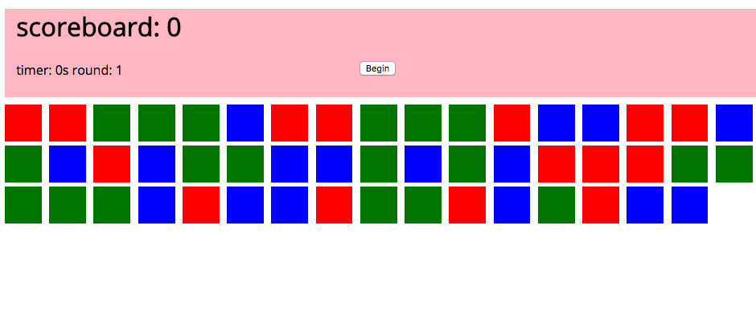

# WDIR-GIZMO

---
Title: PokeAsquare Game <br>
Type: lesson<br>
Creator: Jim Haff for WDI-GiZMO<br>
Competencies: jQuery, Javascript, DOM <br>

---

### Poke A Square

- Were goin to make a game that looks like the following.



- The objective of our game is to click on as many blue squares as possible during the alloted time

### User Stories/game logic

-  When the user clicks begin the timer should start, and the squares should populate with a random color

-  When the use clicks on a color the color should disapear, and score should be added or subtracted

- When the round is over the scores round and time should be updated and the user should be able to start again with increased difficulty. 


### setup 

- open up the `pokeAsquare` folder in student examples, and read over the code
- set up your window onload function in your js file, and log something to make sure it is connected


### Let's begin 

- the first step we are going to tackle is the activating the begin button and load the squares

```
  $('button').on('click', () => {

   console.log('this is working')

  })
```

- Now we need to write a function that sets up our squares

```
  const createSquares = (numberOfSquares) => {
    for (let i = 0; i < NumberOfSquares; i++){
        const square = $('<div/>')
        $('.squares').append(square)
    }
  }
```

- lets call createSquares in the start button function

```
  $('button').on('click', () => {

    createSquares();

  })

```
- Now we have a bunch of blue squares, but we want our squares to have a random, red, blue, or green color try to write a function to make that happen.


```
  const applyRandomColor = (square) => {
    const randNum = Math.floor(Math.random() * 3) + 1

      if(randNum === 1) {
        square.css('background-color', 'red')

      } else if(randNum === 2){
        square.css('background-color', 'blue')

      }
      else {
        square.css('background-color', 'green')

      }
  }

```

-  Where do we use that function?

```
  const createSquares = (numberOfSquares) => {
    for (let i = 0; i < numberOfSquares; i++){
        const square = $('<div/>');

          applyRandomColor(square);

        $('.squares').append(square);
    }
  }
```

-  Now that we have colored squares, lets make them clickable, and hidden when we click on them.  Give it a try!


```
  const createSquares = (numberOfSquares) => {
    for (let i = 0; i < numberOfSquares; i++){
        const square = $('<div/>').on('click', (e) => {

        $(e.currentTarget).css('opacity', 0);
      })

      applyRandomColor(square);

      $('.squares').append(square);
    }
  }
```
- we can make this simple by using jQuery's css method to make the opacity go to zero. 

-  Okay now how do we know if we are clicking on a blue square or not?
-  we can use the css method again like this!

```
  const createSquares = (numberOfSquares) => {
    for (let i = 0; i < numberOfSquares; i++){
        const square = $('<div/>').on('click', (e) => {
        
        const color = $(e.currentTarget).css('background-color');
        
        $(e.currentTarget).css('opacity', 0);
      })

      applyRandomColor(square);

      $('.squares').append(square);
    }
  }
```

- `console.log(color)` it should return something like this `'rgb(0, 0, 255)'`

- So how can we use that, lets write a function that takes that string and if it is blue lets update a global `score` variable.

- create your score variable at the top like the following: 

```
   let score = 0;
```

-  One way to do it is like the following
```
  const checkValidPoke = (square) => {
    console.log(square, typeof square)
    const colors = square.substring(4, square.length-1).split(" ");
    const blue = parseInt(colors[2])

    if(blue === 255){
      score++;
      console.log(score)
    } else {
      score--;
      console.log(score)
    }

  }
```
  - substring lets us take out part of a string.
  - then we are splitting the string by the places so we can get an array number of strings then we are parsing the second index item in the newly created array because we only care about the blue value in rgb

  - now where do we use this? 

```
  const createSquares = (numberOfSquares) => {
    for (let i = 0; i < numberOfSquares; i++){
        const square = $('<div/>').on('click', (e) => {
        
        const color = $(e.currentTarget).css('background-color');
        checkValidPoke(color)
        $(e.currentTarget).css('opacity', 0);
      })

      applyRandomColor(square);

      $('.squares').append(square);
    }
  }

```

- We need to do it in the onclick of each square

- Now lets update the dom with the value of score, give it a try! (Hint: you can do it in the function you just made)

```
  const checkValidPoke = (square) => {
    console.log(square, typeof square)
    const colors = square.substring(4, square.length-1).split(" ");
    const blue = parseInt(colors[2])

    if(blue === 255){
      console.log('this is passign')
      score++;
      $('h1').text('scoreboard: ' + score)
    } else {
      score--;
      $('h1').text('scoreboard: ' + score)
    }

  }
```

- We got alot of the gameplay working now lets set up our timer

- Set up some variables by the score variable like the following 

```
let score = 0;
let time = 30;
let round = 1;

```

- now try to write a function called `setTimer` thats starts an interval and countsdown to 0 and when it reaches 0 increase the round

```
  const setTimer = () => {
    const timer = setInterval(()=>{
      time--
      if(time === 0){
        clearInterval(timer)
        round++;
      }

      updateTime();

    }, 1000)
  }

```

- clearInterval stops the interval saved in the variable `timer`.  The second arguement is the time in ms that the function in the first argument will run. 


- Now write a function called setupRound, that will change the round number on the DOM and set up a new game, if we do this we can just call it in the button so we can reuse that button every round!


```
 const setUpRound = () => {
    $('.squares').empty();
    $('#round').text('round: ' + round)

    if(round === 1){
      createSquares(50);
      time = 30;
    } else if(round === 2){
      createSquares(100);
      time = 20;
    } else if(round === 3){
      createSquares(150);
      time = 10;
    } else {
      createSquares(250);
      time = 10;
    }

 }

```

- We can add some logic here to make the game easier

- Now lets just call our `setUpRound` function in the button

```
  $('button').on('click', () => {

    setTimer();
    setupRound();

  })

```


-  This has meant our requirements or in other words our MVP (minimum viable product)


- So whats some add on we can make up and do together?

- Make the squares lose transparency during each round so you have to click faster.
- Make a Modal to gather the players name at the beginning of the game, and leave them a greeting in the header
- Style it make it look nice
- Make a sound when you click a wrong one or a right one.
- have a modal pop up at the begining of a ready so the user knows how to continue
- make a section about how to play the game (how do you want to do that? an About page, in the header, a modal, idk???? anything you can imagine)
- Anything you can imagine, any twist, any turn you like, USE USE USE your imagination in this, it will allow you to create worlds.


