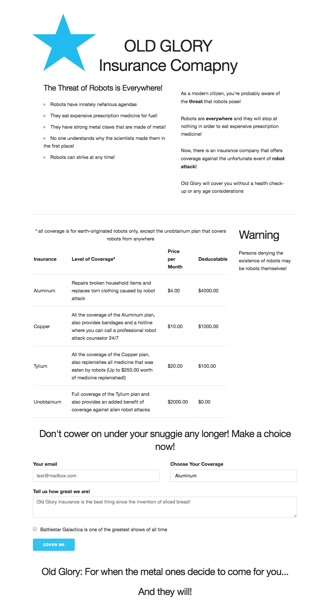
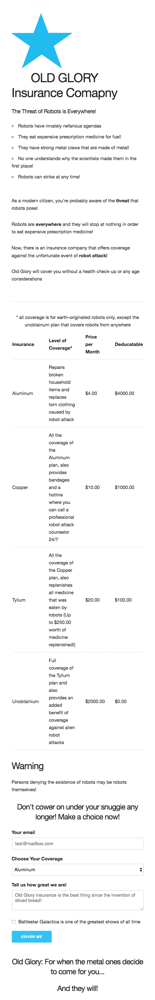

# WDIR-Gizmo

---
Title: Skeleton - CSS Framework Intro and Activity <br>
Type: Morning Exercise<br>
Duration: "0:45"<br>
Creator: Karolin Rafalski<br>
    Course: WDIR-Hopper <br>
Competencies: CSS Frameworks : Normalize.css Skeleton.css <br>
Prerequisites: basic HTML, CSS<br>

---

## CSS Frameworks

## Intro
Frameworks are code that people have put together to aid in solving common issues and building in commonly used features that are ready to go 'right out of the box.'

Every time you go to style your page you probably do the same bare-minimum things:
 - Change the font
 - Add some color
 - Center things some things
 - Add padding/style/color to buttons
 - Make list items look nicer
 - implement a semi-responsive grid

Most CSS frameworks do the above and a lot more

|Framework size|Pros|Cons| Example(s)|
|:-----------:|:------:|:----:|:--:|
| Very Large | Ready to go out of the box, requires no configuration. Has tons of built in features| Very long download time(especially for mobile). For many projects: downloading lots of code that is never used. All projects that use it end up looking very similar. Requires tons of work to appear more custom | Bootstrap |
| Large, but Modular | Use what you need, smaller file sizes, customizable | Requires configuration/set-up, has a learning curve in order to learn to use it properly | Materilize (also comes in out-of-the-box ready version), Bourbon.io |
| Small | No configuration, many common features styled, small file-  fast downloads. Encourages you to build on top of it, using the design features already implemented | May not be suitable for every project | Skeleton|


## Managing Different Browser Defaults
Each browser has default css properties for many html elements.
For example:
 - font
 - font sizing
 - margins
 - padding

Though at first glance these may look similar, when adding CSS, you may see different behaviors and appearances across browsers.

It may be tempting to reset all of the css and start with a blank slate across all the browsers. But this requires a lot of up front work to set all the properties of all the elements.

There is a more middle of the road alternative that lets you stand on the shoulders of giants.


## Normalize.css
  A modern, HTML5-ready alternative to CSS resets.

  By modern, it means it not only standardizes elements, but also gives them a much more modern feel than the defaults of browsers.

  Normalize.css is an open source project that took hundreds of hours of research and efforts to get right and that included making it as small as possible, well commented and modularized (so if you don't want to use the whole file, you can easily copy/paste the part(s) that you need for your project)

  Normalize is small CSS file that is used, in some form, as the base for many other frameworks (Twitter Bootstrap, HTML4 Boilerplate, skeleton,  bourbon.io and many more)

  You can use just normalize.css and add your own css. Already, it will improve the look and feel of your apps with no further css.

  Let's take a look at the student randomizer

  First with no css:
  

  Now with just `normalize.css`
  


[Read more](https://necolas.github.io/normalize.css/)

## Skeleton.css

Bootstrap is great. It's used in a lot of places. But it can be overkill, especially for small projects/quick builds. Skeleton has just a handful of handy features that you don't have to code from scratch:
- mobile in mind: responsive design that makes sense
- 12 column fluid grid iwth a max-width of 960px
- all type is set with `rems` and thus can be responsively sized with ease, default font is Google's Raleway
- Buttons are designed in two styles that look modern and clean with comfortable amount of padding
- Forms are designed in a clean and nice style
- Lists are adjusted to look more modern
- tables are updated with a clean look

Skeleton is considered a starting point, and is designed to make it easy for you to adapt and build on top of it.

[Read more](http://getskeleton.com/)

Here is the student randomize again with Skeleton*:


Additional css to complete this look:
```
body {
  text-align: center;
}

table {
  margin:auto;
}
```

## Activity
You will be updating the look of a web site: Old Glory Insurance

All the html content is there

You will need to:
1. Connect the `main.css` file.
2. Download and include `normalize.css` [normalize](https://necolas.github.io/normalize.css/)
3. Download and include `skeleton.css` [skeleton](http://getskeleton.com/)

 **Important** - does the order that you place the links to the the three css files in the html matter?

4. Go through the [skeleton documentation](http://getskeleton.com/) and add the appropriate classes in the html file to match these views:

Desktop:



<hr>
Mobile views:



<hr>


[Extra special thanks to SNL for the content and  inspiration](http://www.nbc.com/saturday-night-live/video/old-glory-insurance/n10766?snl=1)
